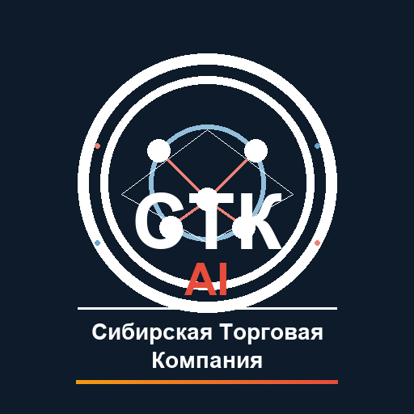

# 🤖 СТК AI-Агент

<div align="center">



**AI-агент для сотрудников ООО «Сибирская Торговая Компания»**

Надёжный поставщик продуктов питания оптом в Томске с 2006 года

</div>

## 🌐 Веб-версия (для сотрудников)

**Просто отправьте сотрудникам ссылку — работает в любом браузере, устанавливать ничего не нужно:**

## 🔗 https://andreasevgeny-design.github.io/stc-agent/

## 📋 О проекте

Многофункциональный AI-агент, разработанный для помощи сотрудникам **ООО «Сибирская Торговая Компания» (СТК)** в повседневных задачах. Агент обучен на данных официального сайта [stkompany.ru](https://stkompany.ru) и заточен под разные бизнес-процессы компании.

## 👥 Роли агента

| Роль | Кому помогает | Задачи |
|------|---------------|--------|
| ⚖️ **Юрист** | Юридический отдел | Договоры (44-ФЗ, 223-ФЗ), тендерная документация, сертификация, претензии, система «Меркурий» |
| 💰 **Бухгалтер** | Бухгалтерия | НДС, счета, акты, отчётность в ФНС/ПФР/ФСС, 1С, дебиторская задолженность |
| 📈 **Менеджер продаж** | Отдел продаж | КП за 2 часа, спецификации, работа с клиентами, ассортимент, доставка |
| 🎯 **Руководитель** | Дирекция | Аналитика KPI, стратегия, планирование, оценка рисков, оптимизация процессов |
| 🎨 **Маркетолог** | Отдел маркетинга | Стратегии продвижения, контент для соцсетей, анализ конкурентов, акции |

## ✨ Возможности

- **Автоматическая маршрутизация** — агент сам определяет, какому отделу адресован запрос
- **База знаний компании** — вся информация с сайта: продукция, цены, логистика, тендеры
- **Каталог продукции** — 11 категорий, бренды, цены от производителей
- **Тендерная поддержка** — 2 390 выигранных тендеров, документы по 44-ФЗ и 223-ФЗ
- **Логистика** — доставка по Томской области и СФО, температурный режим от −18°C до +6°C

## 🚀 Установка

```bash
# Клонирование репозитория
git clone https://github.com/your-username/stc-agent.git
cd stc-agent

# Установка зависимостей
pip install -r requirements.txt
```

## 📖 Использование

```bash
# Запуск демо-режима
python main.py
```

### Примеры запросов

```
"Как оформить договор по 44-ФЗ?"              → Юрист
"Рассчитай НДС за квартал"                    → Бухгалтер
"Сформируй КП для школы"                      → Менеджер продаж
"Проанализируй продажи за месяц"             → Руководитель
"Создай акцию для клиентов"                  → Маркетолог
```

### Программное использование

```python
from main import create_agent, route_query, EmployeeRole

# Маршрутизация запроса
result = route_query("Сформируй коммерческое предложение для детского сада")

# Создание конкретного агента
accountant = create_agent(EmployeeRole.ACCOUNTANT)
invoice = accountant.calculate_vat(100000)
print(invoice)
```

## 📂 Структура проекта

```
stc-agent/
├── main.py                    # Главный модуль с маршрутизацией
├── agents/
│   ├── lawyer.py              # Агент-юрист
│   ├── accountant.py          # Агент-бухгалтер
│   ├── sales_manager.py       # Агент-менеджер продаж
│   ├── director.py            # Агент-руководитель
│   ├── marketer.py            # Агент-маркетолог
│   └── prompts/               # Системные промпты
├── knowledge_base/            # База знаний компании
│   ├── company_info.md        # Информация о компании
│   ├── products.md            # Каталог продукции
│   ├── logistics.md           # Логистика и поставки
│   ├── tenders.md             # Тендеры и госзакупки
│   └── contacts.md            # Контакты
├── assets/
│   ├── logo_ai_stc.svg        # Логотип агента (SVG)
│   ├── logo_ai_stc.png        # Логотип агента (PNG)
│   └── stc_logo_original.png  # Оригинальный логотип СТК с сайта
├── docs/                      # Веб-версия (GitHub Pages)
│   ├── index.html             # Чат-интерфейс
│   ├── app.js                 # Логика агента (JS)
│   ├── styles.css             # Оформление
│   └── logo.png               # Логотип для веба
├── utils/
│   └── make_logo.py           # Генератор логотипа
└── opencode.json              # Конфигурация opencode
```

## 🏢 О компании

**ООО «Сибирская Торговая Компания»** — надёжный поставщик продуктов питания оптом в Томске и Томской области с 2006 года.

- ✅ **20 лет** на рынке оптовых поставок
- ✅ **2 390** выигранных тендеров
- ✅ Склады **1 500 м²** + собственный автопарк
- ✅ Эксклюзивные контракты на говядину
- ✅ Работа по **44-ФЗ** и **223-ФЗ**
- ✅ Полный пакет документов для тендеров

**Адрес:** г. Томск, ул. Пролетарская, 53
**Сайт:** [stkompany.ru](https://stkompany.ru)
**Email:** STKompany@yandex.ru

## 🔄 Интеграция с opencode

Проект включает конфигурацию `opencode.json` для использования с [opencode](https://opencode.ai). Установите API-ключ через переменную окружения:

```bash
export OPENAI_API_KEY=your-key-here
```

## 📄 Лицензия

MIT

---

<div align="center">
  <sub>Создано для сотрудников ООО «Сибирская Торговая Компания» · 2026</sub>
</div>